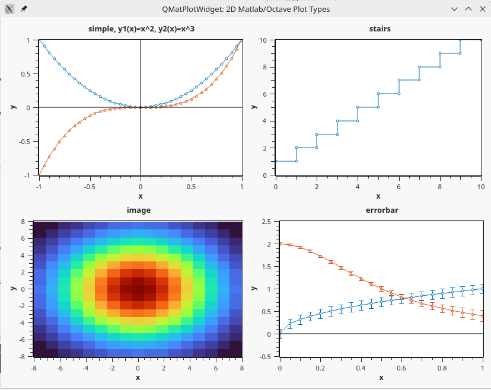

# QMatPlotWidget

A Qt plot widget with a MATLAB/OCTAVE-like interface. 

> part of **QDaq** (https://gitlab.com/qdaq/qdaq) - Qt-based Data Acquisition
>




```c++
    #include "QMatPlotWidget.h"

    const int N = 40;
    QVector<double> x(N+1), y(N+1);
    for(int i=0; i<=N; ++i)
    {
        x[i] = -1. + 2.*i/N;
        y[i] = x[i]*x[i];
    }

    QMatPlotWidget w;
    w.plot(x,y,"o--");
    w.setXlabel("x");
    w.setYlabel("y");
    w.setTitle("y1(x)=x^2, y2(x)=x^3");
    w.show();
```

The QMatPlotWidget class provides only the interface. 

The actual plotting is done with `Qwt` (https://qwt.sourceforge.io/) as a backend.


